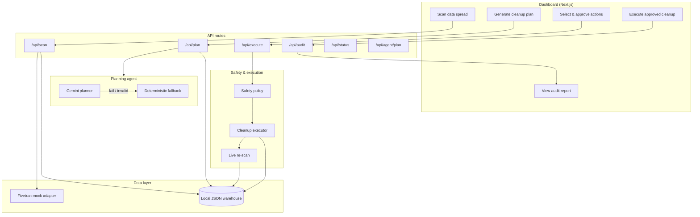

# ConsentOps Agent

**An operational agent that helps teams find, approve, execute, and document data cleanup steps — using synthetic demo data only.**

ConsentOps is **not** a compliance guarantee. It is a human-in-the-loop workflow agent for consent-withdrawal operations: discover where a subject’s data landed, classify what to do with each record, wait for explicit approval, run only approved actions, re-scan to verify, and produce an audit trail.

---

## The problem

When someone withdraws consent, their data rarely lives in one table. It spreads across CRM, commerce, support, marketing, analytics, and payment systems synced into a warehouse. Teams must **find** every copy, **decide** what to delete vs. retain, **execute** safely, and **show** what happened — without accidental table-wide deletes or unapproved changes.

Most tools stop at policy slides. ConsentOps models the full operational loop.

---

## What it does

Given a consent withdrawal for a synthetic subject (Ana Reyes), ConsentOps:

1. **Scans** the demo warehouse (local JSON or BigQuery when configured) across 7 tables — typically **37** matches for Ana Reyes
2. **Maps** where data spread (connectors, tables, confidence, sensitivity)
3. **Plans** record-scoped cleanup actions — `delete`, `anonymize`, `retain`, or `review`
4. **Blocks** unsafe suggestions (payment deletes, wildcards, missing retain reasons)
5. **Requires human approval** before any destructive action runs
6. **Executes** only explicitly approved actions
7. **Re-scans** the warehouse (live verification, not self-reported counts)
8. **Generates** a structured audit report (JSON + markdown)

All demo data is fictional. **Do not use real personal data in this demo.**

---

## Why it is agentic

ConsentOps is not a single API call — it orchestrates a multi-step workflow with guardrails:

| Agent behavior | Implementation |
|----------------|----------------|
| **Discovery** | Cross-table scan with field-level matching and spread mapping |
| **Reasoning** | Gemini planner (optional) or deterministic fallback classifies each record with explanations |
| **Policy enforcement** | Safety layer rejects table-wide deletes, payment mutations, and unapproved actions |
| **Human gate** | Execution blocked until a reviewer selects specific action IDs |
| **Verification loop** | Post-cleanup re-scan compares before/after state |
| **Audit narration** | Report summarizes connectors inspected, actions taken, and records remaining |

The agent proposes and coordinates; **humans approve**. Nothing destructive runs on autopilot.

---

## Google Cloud usage

| Service | Role in demo | Status |
|---------|--------------|--------|
| **Gemini** | Optional cleanup planning via `GEMINI_API_KEY`; deterministic fallback when absent or on failure | Implemented |
| **Cloud Run** | Container deployment for hosted demos | Documented ([deployment guide](docs/cloud-run-deployment.md)); [Terraform IaC](infra/terraform/README.md) |
| **Platform status** | `GET /api/status` — planner mode, adapter modes (no secrets) | Implemented |
| **Agent tool API** | `POST /api/agent/plan` — scan + plan only ([OpenAPI](docs/openapi/consentops-agent.yaml)) | Implemented |
| **BigQuery** | Synthetic warehouse scan / execute / verify (mode-controlled) | Implemented (`CONSENTOPS_WAREHOUSE_MODE`) |
| **Secret Manager** | Recommended for `GEMINI_API_KEY` on Cloud Run | Documented, not wired in app |

The hackathon build runs locally on in-memory fixtures. Cloud Run deployment uses Docker + standalone Next.js output.

---

## Fivetran usage (partner track)

Fivetran is the **data movement layer**: connectors sync into BigQuery; ConsentOps scans the demo warehouse and runs **approval-gated** cleanup.

**Primary integration (Option 1):** [Fivetran MCP](https://github.com/fivetran/fivetran-mcp) in read-only mode (`FIVETRAN_ALLOW_WRITES=false`). With `FIVETRAN_MCP_RUNTIME=true`, the app calls `list_connections` via MCP at runtime (requires [uv](https://docs.astral.sh/uv/) locally); falls back to REST on failure. Evidence: [docs/fivetran-mcp-evidence.md](docs/fivetran-mcp-evidence.md).

**Secondary (Option 2):** read-only **REST** mirror in the web UI when MCP runtime is off or unavailable on Cloud Run; `triggerSync` is disabled.

**Gemini model:** Hackathon copy references Gemini 3; this repo defaults to `gemini-2.5-flash` (configurable via `GEMINI_MODEL`). Not a compliance or version guarantee.

| Capability | Demo |
|------------|------|
| Fivetran MCP (primary) | [Evidence doc](docs/fivetran-mcp-evidence.md) + optional `FIVETRAN_MCP_RUNTIME=true` |
| Connector panel (REST mirror) | `MockFivetranAdapter` without credentials; `RealFivetranAdapter` live read-only REST |
| Trigger sync | **Never** on live REST; **never** via MCP in read-only mode |

Fivetran **moves data**; ConsentOps **governs cleanup** on synthetic fixtures (BigQuery when `CONSENTOPS_WAREHOUSE_MODE=bigquery_full`).

---

## Safety model

Designed so destructive work cannot run by accident:

1. **Synthetic data only** — fictional personas in `src/lib/demo/seedData.ts`
2. **Classified actions** — every record gets `delete` \| `anonymize` \| `retain` \| `review`; `retain` requires `retainReason`
3. **Human approval required** — execution checks approval token + explicit action ID list
4. **No table-wide deletion** — wildcards and empty record sets rejected
5. **Payment records protected** — `payments_transactions` cannot be deleted or anonymized
6. **Plan binding** — only actions from the generated plan may execute
7. **Live verification** — post-cleanup re-scan; audit disclaimers (not legal advice)
8. **Audit on success only** — ConsentOps generates an audit report only after successful approved execution
9. **Gemini is advisory** — Gemini can propose a cleanup plan, but the plan must pass deterministic safety validation or ConsentOps falls back to the deterministic planner

---

## Architecture



---

## Demo flow

```
Consent withdrawal (Ana Reyes)
        │
        ▼
   Scan warehouse ──► 37 matches across 7 tables + Fivetran connector status
        │
        ▼
   Generate plan ──► Classified actions (delete / anonymize / retain / review)
        │
        ▼
   Human approval ──► Reviewer selects specific action IDs
        │
        ▼
   Execute ──► Safety policy gates → approved actions only
        │
        ▼
   Live re-scan ──► Remaining matches counted from warehouse, not fixtures
        │
        ▼
   Audit report ──► Connectors, actions, before/after, disclaimers
```

**Try it:** Scan → Generate cleanup plan → Select actions → Execute approved cleanup → View audit report.

Before execution, the audit panel shows **No execution yet.** Generating a new plan also clears stale audit state.

---

## Local setup

```bash
git clone <repo-url>
cd ConsentOps-Agent
npm install
cp .env.example .env.local
npm run dev
```

Open [http://localhost:3000](http://localhost:3000).

```bash
npm run test        # Vitest — 107 tests
npm run typecheck
npm run lint
npm run build
```

**Deployment:** [docs/cloud-run-deployment.md](docs/cloud-run-deployment.md) — Docker + Cloud Run with `--max-instances=1` for judged demos.

---

## Platform proof (hackathon)

ConsentOps is an **operational agent**, not a compliance guarantee. This section maps what is real vs mocked for judges.

### Hosted demo URL

| Field | Value |
|-------|-------|
| **Cloud Run URL** | https://consentops-agent-538209538110.us-central1.run.app |
| **Local URL** | [http://localhost:3000](http://localhost:3000) |

Deploy steps: [docs/cloud-run-deployment.md](docs/cloud-run-deployment.md). Use `--max-instances=1` so in-memory scan → plan → execute → audit stays on one instance.

**Dashboard screenshots** for judges: attach platform status + Fivetran panel + audit to Devpost, or see [docs/screenshots/README.md](docs/screenshots/README.md).

### Real vs mocked

| Capability | Status | Notes |
|------------|--------|-------|
| Synthetic local warehouse (Ana Reyes, 37 matches) | **IMPLEMENTED** | `src/lib/demo/seedData.ts` |
| Scan → plan → approve → execute → audit UI | **IMPLEMENTED** | Human gate on execute |
| Safety policy (payments retain-only, no table-wide) | **IMPLEMENTED** | `src/lib/execution/safetyPolicy.ts` |
| Gemini planner + deterministic fallback | **IMPLEMENTED** | `src/lib/agent/consentPlanner.ts` |
| Planner provenance badge (Gemini vs fallback) | **IMPLEMENTED** | Shown in cleanup plan panel + `POST /api/plan` |
| `GET /api/status` + platform status card | **IMPLEMENTED** | No secrets in response |
| Fivetran MCP (Option 1, primary) | **IMPLEMENTED** | Cursor evidence doc + optional `FIVETRAN_MCP_RUNTIME=true` (`list_connections` via MCP; REST fallback) |
| Fivetran REST panel (Option 2, UI mirror) | **IMPLEMENTED** | Mock without credentials; live REST when configured |
| `POST /api/agent/plan` (scan + plan only) | **IMPLEMENTED** | Rejects execution-shaped payloads |
| OpenAPI agent spec | **IMPLEMENTED** | [docs/openapi/](docs/openapi/) |
| Cloud Run + Docker image | **IMPLEMENTED** | https://consentops-agent-538209538110.us-central1.run.app |
| Secret Manager for Gemini key | **DOCUMENTED** | Not wired in code |
| Real Fivetran REST status (secondary) | **IMPLEMENTED** | Read-only `GET /v1/connections`; mirrors MCP story in UI |
| BigQuery warehouse | **IMPLEMENTED** | Modes: `local_json`, `bigquery_scan`, `bigquery_full` via `CONSENTOPS_WAREHOUSE_MODE` |
| Fivetran + BigQuery demo | **DOCUMENTED** | [fivetran-bigquery-demo.md](docs/fivetran-bigquery-demo.md) — live connectors + `bigquery_full` cleanup |
| `DEMO_MODE` env-driven adapter switch | **PLANNED** | Flag documented; not read by app yet |
| Durable workflow state | **PLANNED** | In-memory today |

### Proof documents

| Document | Purpose |
|----------|---------|
| [docs/platform-proof-plan.md](docs/platform-proof-plan.md) | Step-by-step submission checklist |
| [docs/fivetran-mcp-evidence.md](docs/fivetran-mcp-evidence.md) | **Primary** Fivetran integration (Option 1 MCP, read-only) |
| [docs/openapi/README.md](docs/openapi/README.md) | Import `POST /api/agent/plan` as an agent tool |
| [docs/cloud-run-deployment.md](docs/cloud-run-deployment.md) | Build, deploy, verify hosted demo |
| [docs/bigquery-demo-setup.md](docs/bigquery-demo-setup.md) | `npm run bigquery:setup` — load synthetic Ana Reyes tables into BigQuery |
| [infra/terraform/README.md](infra/terraform/README.md) | Terraform IaC for Cloud Run |
| [docs/demo-video-script.md](docs/demo-video-script.md) | ~3 min judging video beat sheet |
| [docs/devpost-submission.md](docs/devpost-submission.md) | Devpost copy blocks |

### Pre-submission gate

Do not submit until:

- [x] Cloud Run URL works — https://consentops-agent-538209538110.us-central1.run.app
- [ ] Demo video recorded and linked in Devpost (~3 min; [demo-video-script.md](docs/demo-video-script.md))
- [x] Fivetran MCP (primary) evidence COMPLETED in [fivetran-mcp-evidence.md](docs/fivetran-mcp-evidence.md)
- [ ] No secrets committed (`.env` stays local)
- [ ] `npm run lint && npm run typecheck && npm test && npm run build` pass

---

## Environment variables

Copy `.env.example` to `.env.local`. All keys optional for the default demo.

| Variable | Purpose |
|----------|---------|
| `DEMO_MODE` / `CONSENTOPS_DEMO_MODE` | When true, warehouse ops restricted to synthetic subject allowlist |
| `GEMINI_API_KEY` | Optional Gemini planning; omit for deterministic planner |
| `GEMINI_MODEL` | Gemini model id (default `gemini-2.5-flash`) |
| `CONSENTOPS_WAREHOUSE_MODE` | `local_json` (default), `bigquery_scan`, or `bigquery_full` |
| `FIVETRAN_API_KEY` / `FIVETRAN_API_SECRET` | Same key for MCP and REST |
| `FIVETRAN_MCP_RUNTIME` | `true` to load connectors via Fivetran MCP at runtime (local dev; REST fallback) |
| `FIVETRAN_ALLOW_WRITES` | Must be `false` for MCP runtime (read-only) |
| `GOOGLE_CLOUD_PROJECT` / `BIGQUERY_DATASET` | BigQuery warehouse adapter |
| `GOOGLE_APPLICATION_CREDENTIALS` | ADC for BigQuery locally (Cloud Run uses service account) |

API keys are sent via `x-goog-api-key` header, never in URLs.

---

## Testing

Vitest covers safety-critical paths:

- Classification validation and `retain` + reason enforcement
- Approval gate before execution
- Rejection of table-wide / wildcard / payment delete actions
- Gemini plan validation with deterministic fallback
- API key handling (header auth, redaction in errors)
- Production placeholder stubs reject without leaking secrets
- Demo workflow: scan → plan → execute → audit; stale audit cleared on new plan
- Platform status, agent plan route, OpenAPI spec, Fivetran MCP evidence doc
- Audit report honesty (live re-scan wording, blocked policies)

```bash
npm test
```

---

## Known limitations

- **In-memory state** — demo workflow resets on cold start / redeploy; not suitable for multi-user production without durable storage
- **Hybrid BigQuery scan** — `bigquery_scan` reads from BigQuery but executes on local JSON; load matching synthetic rows first ([setup guide](docs/bigquery-demo-setup.md))
- **Single-instance demo** — Cloud Run should use `--max-instances=1` so the workflow stays on one container
- **Not legal advice** — audit reports include disclaimers; does not certify GDPR or regulatory compliance
- **Fivetran trigger sync** — disabled on live REST adapter; mock-only simulation in UI

---

## Future work

- Durable workflow state (Firestore / Cloud SQL) for multi-session demos
- Secret Manager integration for Cloud Run deployments
- Multi-tenant isolation and auth for production pilots

---

## License

MIT — see [LICENSE](LICENSE).
