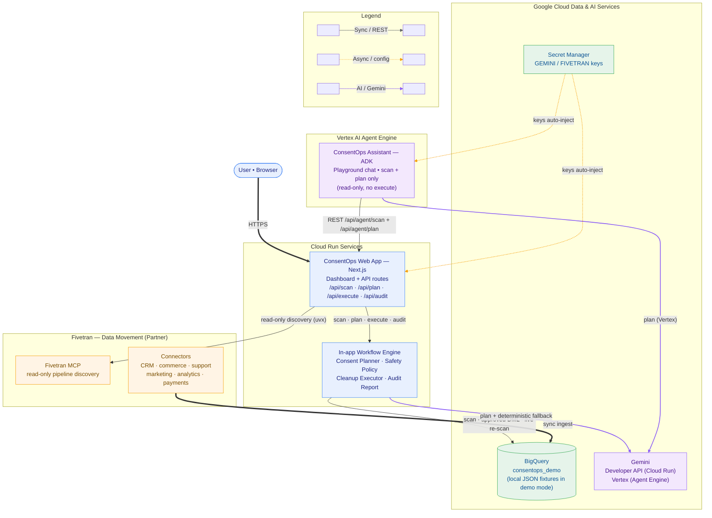

# ConsentOps Agent

[](https://github.com/prabhakaran-jm/ConsentOps-Agent/actions/workflows/ci.yml)
[](LICENSE)
[](https://consentops-agent-538209538110.us-central1.run.app)


**App** &nbsp;


**Cloud · AI · Data** &nbsp;


**An operational agent that helps teams find, approve, execute, and document data cleanup steps — using synthetic demo data only.**

ConsentOps is **not** a compliance guarantee. It is a human-in-the-loop workflow agent for consent-withdrawal operations: discover where a subject’s data landed, classify what to do with each record, wait for explicit approval, run only approved actions, re-scan to verify, and produce an audit trail.

---

## The problem

When someone withdraws consent, their data rarely lives in one table. It spreads across CRM, commerce, support, marketing, analytics, and payment systems synced into a warehouse. Teams must **find** every copy, **decide** what to delete vs. retain, **execute** safely, and **show** what happened — without accidental table-wide deletes or unapproved changes.

Most tools stop at policy slides. ConsentOps models the full operational loop.

---

## What it does

Given a consent withdrawal for a synthetic subject (Ana Reyes), ConsentOps:

1. **Scans** the demo warehouse (local JSON or BigQuery when configured) across 7 tables — quote **`beforeCount`** from the scan (fixtures expect **37** when all seven tables are loaded; run `npm run bigquery:setup` on hosted BigQuery)
2. **Maps** where data spread (connectors, tables, confidence, sensitivity)
3. **Plans** record-scoped cleanup actions — `delete`, `anonymize`, `retain`, or `review`
4. **Blocks** unsafe suggestions (payment deletes, wildcards, missing retain reasons)
5. **Requires human approval** before any destructive action runs
6. **Executes** only explicitly approved actions
7. **Re-scans** the warehouse (live verification, not self-reported counts)
8. **Generates** a structured audit report (JSON + markdown)

All demo data is fictional. **Do not use real personal data in this demo.**

---

## Why it is agentic

ConsentOps is not a single API call — it orchestrates a multi-step workflow with guardrails:

| Agent behavior | Implementation |
|----------------|----------------|
| **Discovery** | Cross-table scan with field-level matching and spread mapping |
| **Reasoning** | Gemini planner (optional) or deterministic fallback classifies each record with explanations |
| **Policy enforcement** | Safety layer rejects table-wide deletes, payment mutations, and unapproved actions |
| **Human gate** | Execution blocked until a reviewer selects specific action IDs |
| **Verification loop** | Post-cleanup re-scan compares before/after state |
| **Audit narration** | Report summarizes connectors inspected, actions taken, and records remaining |

The agent proposes and coordinates; **humans approve**. Nothing destructive runs on autopilot.

---

## Google Cloud usage

| Service | Role in demo | Status |
|---------|--------------|--------|
| **Gemini** | Optional cleanup planning via `GEMINI_API_KEY`; deterministic fallback when absent or on failure | Implemented |
| **Cloud Run** | Container deployment for hosted demos | Documented ([deployment guide](docs/cloud-run-deployment.md)); [Terraform IaC](infra/terraform/README.md) |
| **Platform status** | `GET /api/status` — planner mode, adapter modes (no secrets) | Implemented |
| **Agent tool API** | `POST /api/agent/scan` + `POST /api/agent/plan` — read-only ([OpenAPI](docs/openapi/consentops-agent.yaml); [Agent Builder setup](docs/agent-builder-setup.md)) | Implemented |
| **BigQuery** | Synthetic warehouse scan / execute / verify (mode-controlled) | Implemented (`CONSENTOPS_WAREHOUSE_MODE`) |
| **Secret Manager** | Recommended for `GEMINI_API_KEY` on Cloud Run | Documented, not wired in app |

The demo runs locally on in-memory fixtures by default. Cloud Run deployment uses Docker + standalone Next.js output.

---

## Fivetran integration

Fivetran is the **data movement layer**: connectors sync into BigQuery; ConsentOps scans the demo warehouse and runs **approval-gated** cleanup.

**MCP (primary):** [Fivetran MCP](https://github.com/fivetran/fivetran-mcp) in read-only mode (`FIVETRAN_ALLOW_WRITES=false`). With `FIVETRAN_MCP_RUNTIME=true`, the app runs five discovery tools at scan time; see [docs/fivetran-mcp.md](docs/fivetran-mcp.md).

**REST (secondary):** read-only connector panel when MCP runtime is off or spawn fails; `triggerSync` is disabled.

---

## Safety model

Designed so destructive work cannot run by accident:

1. **Synthetic data only** — fictional personas in `src/lib/demo/seedData.ts`
2. **Classified actions** — every record gets `delete` \| `anonymize` \| `retain` \| `review`; `retain` requires `retainReason`
3. **Human approval required** — execution checks approval token + explicit action ID list
4. **No table-wide deletion** — wildcards and empty record sets rejected
5. **Payment records protected** — `payments_transactions` cannot be deleted or anonymized
6. **Plan binding** — only actions from the generated plan may execute
7. **Live verification** — post-cleanup re-scan; audit disclaimers (not legal advice)
8. **Audit on success only** — ConsentOps generates an audit report only after successful approved execution
9. **Gemini is advisory** — Gemini can propose a cleanup plan, but the plan must pass deterministic safety validation or ConsentOps falls back to the deterministic planner

---

## Architecture

Hosted Cloud Run uses **`bigquery_full`** (scan, execute, and verify on BigQuery). Local dev defaults to **in-memory JSON fixtures** unless you configure BigQuery. Fivetran runs **read-only MCP discovery** at scan time when credentials are set.



<details>
<summary>Mermaid version (GitHub-native)</summary>



</details>

| Layer | Components |
|-------|------------|
| **Ingestion** | Fivetran connectors → BigQuery dataset (demo uses `npm run bigquery:setup` fixtures) |
| **Discovery** | Fivetran MCP at scan (`list_connections`, sync state, destinations) + warehouse subject scan |
| **Reasoning** | Gemini cleanup plan, validated by deterministic safety rules |
| **Execution** | Approval-gated DML on BigQuery (`bigquery_full`) or in-memory JSON (`local_json`) |
| **Verification** | Post-execute live re-scan — counts come from the warehouse, not hardcoded |
| **Agent APIs** | Read-only `/api/agent/*` for Google ADK / Agent Builder (scan, plan, Fivetran tools) |

---

## Demo flow

Example walkthrough for synthetic subject **Ana Reyes** (hosted BigQuery after `npm run bigquery:setup`, or local JSON fixtures):

```
Consent withdrawal (Ana Reyes)
        │
        ▼
   Scan warehouse ──► 37 matches across 7 tables + Fivetran MCP discovery
        │              (quote live beforeCount from the scan response)
        ▼
   Generate plan ──► 37 classified actions (delete / anonymize / retain / review)
        │
        ▼
   Human approval ──► e.g. 3 action IDs: 1 delete + 1 anonymize + 1 retain
        │
        ▼
   Execute ──► Safety policy gates → approved actions only
        │
        ▼
   Live re-scan ──► 35 remaining matches (37 − delete − anonymize; retain stays)
        │
        ▼
   Audit report ──► Before 37 / After 35 · 3 approved & executed · retain policies
        │
        ▼
   Re-scan (optional) ──► Step 1 “Re-scan data spread” confirms 35 on warehouse
```

| Step | Expected count | Notes |
|------|----------------|-------|
| Initial scan | **37** | All seven demo tables loaded (`seedData.ts` / `bigquery:setup`) |
| After 3-action execute | **35** | One delete + one anonymize remove live matches; retain does not |
| Audit hero | **37 → 35** | “2 matches removed or anonymized” on live re-scan |
| Post-audit re-scan | **35** | Independent confirmation from Step 1 |

**Try it:** Scan → Generate cleanup plan → Select actions → Slide to confirm execute → View audit report → Re-scan.

Before execution, the audit panel shows **No execution yet.** Generating a new plan clears stale audit state.

---

## Local setup

```bash
git clone https://github.com/prabhakaran-jm/consentops-agent.git
cd ConsentOps-Agent
npm install
cp .env.example .env.local
npm run dev
```

Open [http://localhost:3000](http://localhost:3000).

```bash
npm run test        # Vitest — 159 tests
npm run typecheck
npm run lint
npm run build
```

**Deployment:** [docs/cloud-run-deployment.md](docs/cloud-run-deployment.md) — Docker + Cloud Run with `--max-instances=1` for in-memory demo state.

---

## Documentation

| Guide | Purpose |
|-------|---------|
| [docs/cloud-run-deployment.md](docs/cloud-run-deployment.md) | Build, deploy, verify hosted demo |
| [docs/agent-builder-setup.md](docs/agent-builder-setup.md) | ADK local chat + Agent Engine deploy |
| [docs/fivetran-mcp.md](docs/fivetran-mcp.md) | Fivetran MCP read-only integration |
| [docs/bigquery-demo-setup.md](docs/bigquery-demo-setup.md) | Load synthetic fixtures + `bigquery_full` mode |
| [docs/openapi/](docs/openapi/) | Read-only agent API (`/api/agent/scan`, `/api/agent/plan`) |
| [consentops-adk/README.md](consentops-adk/README.md) | ADK agent package |
| [infra/terraform/README.md](infra/terraform/README.md) | Terraform IaC |

**Hosted demo:** https://consentops-agent-538209538110.us-central1.run.app

### Capabilities (real vs mocked)

| Capability | Status |
|------------|--------|
| Scan → plan → approve → execute → audit UI | Implemented |
| Safety policy (payments retain-only, no table-wide) | Implemented |
| Gemini planner + deterministic fallback | Implemented |
| `GET /api/status` | Implemented |
| Fivetran MCP discovery (5 tools) | Implemented when configured |
| Fivetran REST panel | Mock without credentials; live when configured |
| BigQuery `bigquery_full` | Implemented — see setup guide |
| ADK + Agent Engine | Implemented |
| Demo subject allowlist (`DEMO_MODE`) | Implemented |
| Durable workflow state | In-memory only (Cloud Run: use `--max-instances=1`) |

---

## Environment variables

Copy `.env.example` to `.env.local`. All keys optional for the default demo.

| Variable | Purpose |
|----------|---------|
| `DEMO_MODE` / `CONSENTOPS_DEMO_MODE` | When true, warehouse ops restricted to synthetic subject allowlist |
| `GEMINI_API_KEY` | Optional Gemini planning; omit for deterministic planner |
| `GEMINI_MODEL` | Gemini model id (default `gemini-3.5-flash`) |
| `CONSENTOPS_WAREHOUSE_MODE` | `local_json` (default), `bigquery_scan`, or `bigquery_full` |
| `FIVETRAN_API_KEY` / `FIVETRAN_API_SECRET` | Same key for MCP and REST |
| `FIVETRAN_MCP_RUNTIME` | `true` to load connectors via Fivetran MCP at runtime (Cloud Run image includes `uv`; REST fallback) |
| `FIVETRAN_ALLOW_WRITES` | Must be `false` for MCP runtime (read-only) |
| `GOOGLE_CLOUD_PROJECT` / `BIGQUERY_DATASET` | BigQuery warehouse adapter |
| `GOOGLE_APPLICATION_CREDENTIALS` | ADC for BigQuery locally (Cloud Run uses service account) |

API keys are sent via `x-goog-api-key` header, never in URLs.

---

## Testing

Vitest covers safety-critical paths:

- Classification validation and `retain` + reason enforcement
- Approval gate before execution
- Rejection of table-wide / wildcard / payment delete actions
- Gemini plan validation with deterministic fallback
- API key handling (header auth, redaction in errors)
- Production placeholder stubs reject without leaking secrets
- Demo workflow: scan → plan → execute → audit; stale audit cleared on new plan
- Platform status, agent routes, OpenAPI spec, Fivetran MCP doc
- Audit report honesty (live re-scan wording, blocked policies)

```bash
npm test
```

---

## Known limitations

- **In-memory state** — demo workflow resets on cold start / redeploy; not suitable for multi-user production without durable storage
- **Hybrid BigQuery scan** — `bigquery_scan` reads from BigQuery but executes on local JSON; load matching synthetic rows first ([setup guide](docs/bigquery-demo-setup.md))
- **Single-instance demo** — Cloud Run should use `--max-instances=1` so the workflow stays on one container
- **Not legal advice** — audit reports include disclaimers; does not certify GDPR or regulatory compliance
- **Fivetran trigger sync** — disabled on live REST adapter; mock-only simulation in UI

---

## Future work

- Durable workflow state (Firestore / Cloud SQL) for multi-session demos
- Secret Manager integration for Cloud Run deployments
- Multi-tenant isolation and auth for production pilots

---

## License

MIT — see [LICENSE](LICENSE).
