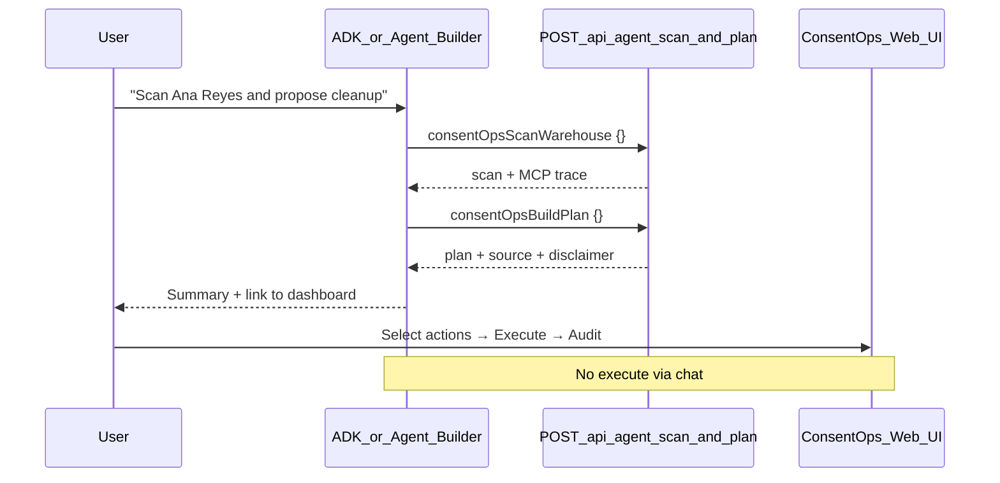

# ConsentOps chat front-end (Agent Builder / ADK)

Use a **conversational front-end** that calls your hosted ConsentOps read-only API. **Approval, execute, and audit stay in the web UI** — the chat agent never gets write access.

| Role | Surface |
|------|---------|
| Chat (scan + plan) | **ADK Web UI** (recommended) or Vertex AI Agent Builder |
| Approve → execute → audit | [ConsentOps dashboard](https://consentops-agent-538209538110.us-central1.run.app) |

---

## Architecture



ConsentOps on Cloud Run still owns Gemini planning, BigQuery scan, and Fivetran MCP at runtime. The chat layer orchestrates **two** read-only OpenAPI operations (scan, then plan).

---

## Prerequisites

- GCP project: `rapid-agent-hackathon-26` (or yours)
- Live Cloud Run URL returns **200** on `/api/status`
- For local ADK: `GEMINI_API_KEY` for the ADK agent model calls

Verify the tool endpoint:

```bash
curl -s -X POST https://consentops-agent-538209538110.us-central1.run.app/api/agent/scan \
  -H "Content-Type: application/json" \
  -d '{}' | head -c 400
```

Expect `"capability":"scan_only"`. Then:

```bash
curl -s -X POST https://consentops-agent-538209538110.us-central1.run.app/api/agent/plan \
  -H "Content-Type: application/json" \
  -d '{}' | head -c 400
```

Expect `"capability":"plan_only"` and `"source":"gemini"` or `"deterministic"`.

---

## Path A — ADK chat agent (recommended)

**Vertex AI Agent Builder Studio** (Flow UI) currently exposes **Google Search, URL Context, Vertex AI Search, and MCP Server** — not a first-class OpenAPI tool import. Use the ADK project in this repo instead; it exposes `consentOpsScanWarehouse` and `consentOpsBuildPlan` against Cloud Run.

### Step 1 — Install and configure

```bash
cd consentops-adk
pip install -r requirements.txt
export GEMINI_API_KEY=your_key
```

### Step 2 — Start ADK Web UI

From the **repo root** (not inside the agent subfolder):

```bash
adk web consentops-adk --port 8081
```

Open http://127.0.0.1:8081 → select **consentops_assistant**.

**Windows note:** default port **8000** is often blocked or already in use (e.g. Splunk). Use `--port 8081` or `8888`.

### Step 3 — Test in chat

Try:

> Scan the demo subject and summarize where data spread. Propose cleanup at a high level — do not execute anything.

**Expect the agent to:**

- Call `consentOpsScanWarehouse`, then `consentOpsBuildPlan`
- Report the exact `scan.matchCount` from the tool (BigQuery on Cloud Run is typically **25**; local JSON fixtures are **37** — do not hardcode)
- Mention Fivetran connector count (read-only)
- State `source: gemini` or `deterministic`
- Link to the **ConsentOps dashboard** for approval and execution

Implementation: [consentops-adk/consentops_assistant/agent.py](../consentops-adk/consentops_assistant/agent.py) calls the hosted API and loads [agent-builder-system-prompt.txt](./agent-builder-system-prompt.txt). OpenAPI reference: [openapi/consentops-agent-cloudrun.yaml](./openapi/consentops-agent-cloudrun.yaml).

More detail: [consentops-adk/README.md](../consentops-adk/README.md).

---

## Path B — Vertex AI Agent Builder (when OpenAPI tool is available)

If your console version supports **Create tool → OpenAPI**, you can wire the same backend without ADK:

1. **Tools** → **Create tool** → **OpenAPI**
2. **Name:** `consentOps_scan` and `consentOps_plan` (or import both operations from the schema)
3. **Schema:** paste [openapi/consentops-agent-cloudrun.yaml](./openapi/consentops-agent-cloudrun.yaml)
4. **Authentication:** None (public Cloud Run demo)
5. **Create agent** → attach that tool only
6. **Instructions:** paste [agent-builder-system-prompt.txt](./agent-builder-system-prompt.txt)

If the Flow UI only shows MCP / built-ins, use **Path A (ADK)** above.

**Studio preview shows only a single combined scan/plan tool with no result?** The Flow UI referenced tool names in instructions but did not attach callable backends (OpenAPI/MCP). Use **Path C** below instead of trying to fix the hand-built Studio agent.

---

## Path C — Deploy ADK agent to Agent Engine (hosted Agent Builder)

This publishes the **same agent that works in `adk web`** to Google Cloud. It appears under **Vertex AI → Agent Engine / Agents** and is the right path when Studio Flow cannot import OpenAPI tools.

### Prerequisites

- `gcloud auth application-default login`
- APIs enabled: **Vertex AI API**
- A GCS bucket for staging (e.g. `gs://rapid-agent-hackathon-26-adk-staging`)
- `.env` in repo root with `GOOGLE_CLOUD_PROJECT=rapid-agent-hackathon-26` (and `GEMINI_API_KEY` or Vertex auth)

### Deploy (automated)

**Terraform** creates the staging bucket and enables Vertex AI API. **ADK CLI** deploys the agent (Terraform alone cannot replace `adk deploy` — ADK generates packaging and `class_methods`).

```bash
# One-time infra
cd infra/terraform && terraform apply && cd ../..

# Deploy / update agent (Git Bash)
chmod +x scripts/deploy-adk-agent-engine.sh
./scripts/deploy-adk-agent-engine.sh
```

Windows: `.\scripts\deploy-adk-agent-engine.ps1`

The script reads `GOOGLE_CLOUD_PROJECT` from `.env`, staging bucket from `terraform output adk_staging_bucket`, and saves `consentops-adk/.agent_engine_id` after first deploy for idempotent updates.

**Windows:** ADK 1.14 embeds `C:\Users\...` paths in generated Python and fails with a `unicodeescape` error. The repo deploy script patches this automatically via `scripts/deploy_adk_agent_engine.py`.

### Deploy (manual)

```bash
adk deploy agent_engine \
  --project=rapid-agent-hackathon-26 \
  --region=us-central1 \
  --staging_bucket=gs://YOUR_STAGING_BUCKET \
  --display_name="ConsentOps Assistant" \
  --trace_to_cloud \
  consentops-adk/consentops_assistant
```

Takes several minutes. When done, open **Google Cloud Console → Vertex AI → Agent Engine** (or **Agents** in Agent Platform Studio) and chat with the deployed **ConsentOps Assistant**.

The agent folder is self-contained (`agent.py`, `instructions.txt`, `requirements.txt`) and calls the same hosted Cloud Run `/api/agent/plan` endpoint.

To update an existing deployment, pass `--agent_engine_id=YOUR_REASONING_ENGINE_ID` or use the deploy script (reads `consentops-adk/.agent_engine_id`).

---

## Troubleshooting

| Symptom | Fix |
|---------|-----|
| `[winerror 10013]` on port 8000 | Another service owns 8000 — run `adk web consentops-adk --port 8081` |
| `unicodeescape` on Agent Engine deploy (Windows) | Use `./scripts/deploy-adk-agent-engine.sh` (patches ADK template); do not call raw `adk deploy` on Windows |
| `400 Environment variable name 'GOOGLE_CLOUD_PROJECT' is reserved` | Do **not** put reserved GCP env names (`GOOGLE_CLOUD_PROJECT`, `GOOGLE_CLOUD_LOCATION`) in the deployment `env_vars`. Agent Engine injects project/region automatically; the deploy script only sends `GOOGLE_GENAI_USE_VERTEXAI` and `GEMINI_MODEL` (see `_build_env_vars`) |
| `UnicodeEncodeError: 'charmap' codec can't encode` after a successful create (Windows) | Cosmetic cp1252 console crash on status output (`→`/`—`); the deploy already succeeded and `.agent_engine_id` is saved. The script forces UTF-8 stdout/stderr in `main()` to prevent it |
| Console **Deployments → Framework: custom** (ADK Playground disabled) | The SDK calls `ModuleAgent.clone()` during validation, and stock `clone()` drops `agent_framework`, so detection falls back to `custom`. The deploy script patches `clone()` to preserve `agent_framework` (`_patch_module_agent_clone`); redeploy with `python scripts/deploy_adk_agent_engine.py` to show **google-adk** and enable the Playground |
| Playground **404 NOT_FOUND** on `gemini-3.5-flash` (`publishers/google/models/...`) | **Agent Engine always runs Gemini via Vertex AI** — the ADK reasoning-engine template hard-sets `GOOGLE_GENAI_USE_VERTEXAI=1` at runtime, so a deployment env of `FALSE` (Gemini Developer API + API key) is ignored. `gemini-3.5-flash` is Developer-API-only and a 404 as a Vertex publisher model in `us-central1`. Use a **Vertex-valid** model: set `ADK_GEMINI_MODEL=gemini-2.5-flash` (the agent reads this, not the Cloud Run `GEMINI_MODEL`). Cloud Run keeps `gemini-3.5-flash` on the Developer API |
| Model/code change **doesn't take effect** after redeploy (still old model) | `agent_engines.update()` updates spec/env but does **not** rebuild the agent container from new code, and the model is baked from `agent.py` at import. After changing the baked model or agent code, **delete the engine + `consentops-adk/.agent_engine_id` and redeploy** (create path) — `vertexai.agent_engines.delete(resource_name, force=True)` |
| `root_agent not found` | Run `adk web` with **agents dir** `consentops-adk` from repo root; each agent needs `consentops_assistant/agent.py` |
| Tool timeout / **503 Service Unavailable** on scan or plan | Usually Cloud Run **OOM** during scan+plan (Fivetran MCP `uvx` + BigQuery + Gemini exceeds **512Mi**). Cloud Run logs show `Memory limit of 512 MiB exceeded`. Fix: set service memory to **2Gi** (`gcloud run services update consentops-agent --memory=2Gi` or Terraform `memory = "2Gi"`). Cold start + MCP warmup can also add ~20–30s on first call — retry once after memory is raised |
| `400` execution fields rejected | Agent tried to pass approve/execute keys — tighten system prompt |
| `source: deterministic` only | `GEMINI_API_KEY` missing on Cloud Run or model ID issue — check `/api/status` |
| Agent hallucinates execution | Reiterate in prompt: execution is **UI only**; repeat API `disclaimer` |

---

## What stays out of Agent Builder (by design)

| Capability | Why |
|------------|-----|
| `POST /api/execute` | Human approval gate |
| Fivetran sync / writes | Read-only partner posture |
| BigQuery DML | Approval-gated in UI after explicit action selection |
| Real PII | Synthetic demo only |

Full OpenAPI reference: [openapi/README.md](./openapi/README.md).
