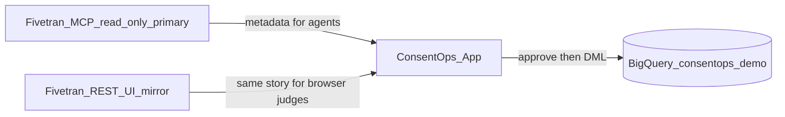

# Fivetran integration — MCP primary (read-only)

> **Read-only MCP evidence.** No sync, write, or cleanup was performed via Fivetran MCP.
> ConsentOps cleanup runs on the **synthetic BigQuery demo dataset** (`consentops_demo`) with human approval — never through MCP or Fivetran APIs.

| Field | Value |
|-------|-------|
| **Fivetran integration (partner track)** | **Option 1 — MCP (primary)** |
| **Secondary in-app surface** | Option 2 REST — read-only status panel for judges who open the web UI only |
| **Evidence status** | `COMPLETED` — sanitized MCP capture (2026-06-04 Cursor session; optional: add MCP config screenshot to Devpost) |
| **MCP mode** | Read-only (`FIVETRAN_ALLOW_WRITES=false`) |
| **Captured by** | ConsentOps Agent (Cursor MCP session) |
| **Captured at** | 2026-06-04 (relative times in summary) |
| **MCP host** | Cursor (`user-fivetran` MCP server) |

---

## Integration model

ConsentOps treats **Fivetran MCP** as the **primary** partner integration for agent-native data-movement context:

| Layer | Role |
|-------|------|
| **Fivetran MCP (primary)** | Cursor/agent MCP session (this doc) + optional app runtime when `FIVETRAN_MCP_RUNTIME=true` (`list_connections` via MCP) |
| **Fivetran REST (secondary)** | Step 2 UI mirror when MCP runtime off or fails (e.g. Cloud Run without `uv`); `triggerSync` disabled |
| **Gemini** | Advisory cleanup planner (deterministic safety validation required) |
| **ConsentOps safety engine** | Approval-gated executor; record-scoped actions only |
| **BigQuery (`bigquery_full`)** | Scan, execute, and live re-scan on synthetic `consentops_demo` fixtures |



- **MCP** is how builders/agents validate the Fivetran landscape (this document + MCP host screenshots).
- **REST** does not replace MCP; it mirrors connector status for the hosted demo.
- **No line** from MCP or Fivetran REST to destructive cleanup.

---

## Purpose (for judges)

This document proves ConsentOps aligns with the **Google Cloud Rapid Agent Hackathon** partner expectation: use the **[Fivetran MCP server](https://github.com/fivetran/fivetran-mcp)** as the **agent-native** integration path, with writes disabled.

**BigQuery destination** (`connector_01` / schema `bigquery_db` → `destination_01`) demonstrates Fivetran moving data; **ConsentOps** governs consent cleanup after human approval on the synthetic demo dataset.

---

## MCP setup (read-only)

Use the same API key as REST ([authentication](https://fivetran.com/docs/rest-api/getting-started#authentication)).

**Required:** `FIVETRAN_ALLOW_WRITES=false`

Example (Cursor / Claude Code style — adjust for your MCP host):

```bash
# Fivetran MCP — read-only (see https://github.com/fivetran/fivetran-mcp )
FIVETRAN_API_KEY=<your-key>
FIVETRAN_API_SECRET=<your-secret>
FIVETRAN_ALLOW_WRITES=false
```

Example server invocation from the upstream README:

```bash
uvx --from git+https://github.com/fivetran/fivetran-mcp fivetran-mcp
```

### Safe MCP operations (run these)

- Query account / group context (if exposed by your MCP tools)
- List connections
- Inspect connection status, health, or last-sync **summary**
- Confirm **no** sync trigger, schema change, or write tools were invoked

### Do not run via MCP

- Force sync / trigger sync
- Create or modify connections
- Any cleanup, delete, or warehouse mutation

---

## App runtime MCP (`FIVETRAN_MCP_RUNTIME`)

When `FIVETRAN_MCP_RUNTIME=true` and `FIVETRAN_ALLOW_WRITES=false`, the Next.js app spawns the upstream Fivetran MCP server via stdio (`uvx --from git+https://github.com/fivetran/fivetran-mcp fivetran-mcp` by default) and calls **`list_connections`** only. On failure, `McpFivetranAdapter` falls back to read-only REST.

| Environment | Typical source | Notes |
|-------------|----------------|-------|
| Local `npm run dev` | `mcp_runtime` when flag + [uv](https://docs.astral.sh/uv/) installed | `GET /api/status` → `fivetranIntegrationSource: "mcp_runtime"` |
| Cloud Run (Alpine) | `rest` | Dockerfile has no `uv`; REST mirror is honest fallback |

Env vars: `FIVETRAN_MCP_RUNTIME`, `FIVETRAN_ALLOW_WRITES=false`, optional `FIVETRAN_MCP_COMMAND` / `FIVETRAN_MCP_ARGS`. See `.env.example`.

---

## How to complete the sanitized capture

1. Configure [fivetran-mcp](https://github.com/fivetran/fivetran-mcp) in your MCP host with `FIVETRAN_ALLOW_WRITES=false`.
2. Run only the [safe operations](#safe-mcp-operations-run-these) above.
3. Copy output to a **private** scratch file (never commit raw output).
4. Sanitize using the [redaction checklist](#redaction-checklist) below.
5. Replace the [sanitized summary](#sanitized-summary-placeholder) and set sanitized capture to `COMPLETED` in the table at the top.
6. Add 1–2 screenshots to Devpost (MCP tool list + redacted connection summary).

**Never commit:** API key, API secret, OAuth tokens, raw connector IDs, account IDs, group IDs, destination IDs, or production URLs.

---

## Session attestation (explicit)

Captured during a Cursor agent session against the `user-fivetran` MCP server. Confirmations below apply to **that session only**.

1. **`FIVETRAN_ALLOW_WRITES=false`** — Read-only mode was required for all MCP calls in this session. No write, sync, create, modify, or delete tools were invoked; the agent was instructed to stay read-only throughout.
2. **Tools used (only these five):**
   - `get_account_info`
   - `list_connections`
   - `get_connection_details` (on `connector_01` after schema alias `bigquery_db` returned 404)
   - `get_connection_state` (on `connector_01`; API returned **405 Method Not Allowed** — no state change)
   - `list_destinations`
3. **Tools not called** — No `sync_connection`, `modify_connection`, `delete_connection`, or any webhook tool (`list_webhooks`, `create_*_webhook`, `modify_webhook`, `delete_webhook`, `test_webhook`, etc.). No POST/PATCH/DELETE-class MCP operations.

---

## Sanitized summary

Redacted aliases only — no raw connector, account, group, or destination IDs; no API secrets or project IDs.

### Account (from `get_account_info`)

| Field | Sanitized value |
|-------|-----------------|
| Account label | Demo personal account |
| ESM support | Azure Key Vault, AWS Secrets Manager, HashiCorp Vault supported; Google Secret Manager not supported |

### Connections (from `list_connections` + `get_connection_details`)

| Alias | Connector name (sanitized) | Service | Paused | setup_state | sync_state | Last sync (relative) | failed_at |
|-------|---------------------------|---------|--------|-------------|------------|----------------------|-----------|
| `connector_01` | BigQuery warehouse connector | `bigquery` (schema `bigquery_db`) | no | connected | scheduled | ~2h ago (success) | — |
| `connector_02` | Fivetran metadata connector | `fivetran_log` | no | connected | scheduled | historical sync in progress | — |
| `connector_A` | _(reserved alias example)_ | `source` → `destination_1` | — | — | — | — | — |

**`connector_01` detail (`get_connection_details`):** healthy — connected, on schedule, not paused, no warnings, historical sync complete. Destination dataset name shown in API as demo dataset (redacted). **`get_connection_state`:** read-only call attempted; HTTP 405 (no sync triggered).

**Note:** `bigquery_db` is the **schema name**, not the MCP `connection_id`. Use alias `connector_01` for detail/state calls.

### Destination (from `list_destinations`)

| Alias | Type | Region (if shown) | setup_status |
|-------|------|-------------------|--------------|
| `destination_01` | BigQuery (`big_query`) | AWS_US_EAST_1 (control plane) | connected |

### Aggregate counts

| Metric | Value |
|--------|-------|
| Connections observed | 2 |
| Healthy (connected + scheduled) | 2 |
| Warning | 0 |
| Paused | 0 |
| Sync operations triggered via MCP | **0** |
| Cleanup / delete operations via MCP | **0** |
| `FIVETRAN_ALLOW_WRITES` | **false** |

### Operations log (sanitized)

| Step | MCP tool | Result (sanitized) |
|------|----------|-------------------|
| 1 | `get_account_info` | Demo account context; ESM types listed (no secrets) |
| 2 | `list_connections` | 2 rows → `connector_01`, `connector_02` |
| 3 | `get_connection_details` | `connector_01` healthy; schema `bigquery_db`; demo dataset (redacted) |
| 4 | `get_connection_state` | `connector_01` — 405 read-only failure (no side effects) |
| 5 | `list_destinations` | 1 destination → `destination_01`, connected |
| — | _(not called)_ | No sync, modify, delete, or webhook tools |

---

## Relationship to REST panel (secondary)

When judges open **only** the ConsentOps web app (no MCP host), Step 2 shows the same narrative via **read-only REST**:

- Mode: `live_read_only`
- Redacted display keys (`connector_01`, …)
- `RealFivetranAdapter` — `GET /v1/connections`; `triggerSync` throws `ReadOnlyFivetranError`

MCP remains **primary** in submission copy; REST is a **mirror**, not the main integration choice.

---

## Redaction checklist

Before committing updates to this file, confirm:

- [x] Top table states **Option 1 — MCP (primary)**
- [x] Session attestation and sanitized summary filled (`COMPLETED`)
- [x] No `FIVETRAN_API_KEY`, `FIVETRAN_API_SECRET`, or token strings in committed capture
- [x] No raw Fivetran connector IDs from your account in committed capture
- [x] No account / group / destination UUIDs in committed capture
- [x] No production URLs with real IDs in committed capture
- [x] Only stable aliases (`connector_01`, `destination_01`, etc.)
- [x] Operations log confirms **zero** sync triggers and **zero** cleanup via MCP
- [x] Read-only banner still present
- [x] Submission does not claim cleanup runs via Fivetran

---

## Judge misunderstanding risk

| Risk | Prevention |
|------|------------|
| “ConsentOps deleted data via Fivetran/MCP” | Banner + operations log; cleanup is approval-gated BigQuery DML on synthetic demo data |
| “REST is the only Fivetran integration” | This doc labels MCP **primary**; REST is UI mirror |
| “MCP credentials are in the repo” | Redaction checklist; secrets in env / Secret Manager only |

---

## Related docs

- [Fivetran + BigQuery demo](fivetran-bigquery-demo.md) — warehouse setup and `bigquery_full` mode
- [Platform proof plan](platform-proof-plan.md) — submission checklist
- [Fivetran MCP server](https://github.com/fivetran/fivetran-mcp) — upstream Option 1
- [Fivetran REST API](https://fivetran.com/docs/rest-api) — Option 2 (secondary in this project)
- [BigQuery destination setup](https://fivetran.com/docs/destinations/bigquery/setup-guide)
- [Cloud Run deployment](cloud-run-deployment.md)
