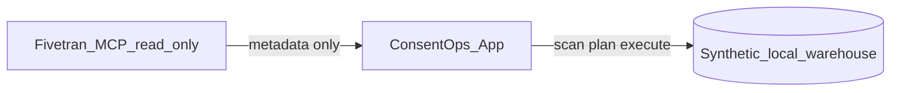

# Fivetran MCP evidence (read-only)

> **Read-only MCP evidence.** No sync, write, or cleanup was performed via Fivetran MCP.
> ConsentOps cleanup runs only on the **synthetic local warehouse** in the web demo — never through MCP.

| Field | Value |
|-------|-------|
| **Evidence status** | `TEMPLATE` — replace placeholders after you capture sanitized MCP output |
| **MCP mode** | Read-only (list / status / metadata only) |
| **Captured by** | _Your name / team_ |
| **Captured at** | _YYYY-MM-DD (relative times OK)_ |
| **MCP host** | _e.g. Cursor, Claude Desktop — do not paste host secrets_ |

---

## Purpose (for judges)

This document proves that ConsentOps was validated against **Fivetran connector metadata** using the Fivetran MCP server in **read-only** mode. It supports the partner-track story: Fivetran moves data; ConsentOps governs consent cleanup with human approval.

**This is not proof of production Fivetran integration in the app.** The in-app panel uses `MockFivetranAdapter` unless read-only REST status is implemented later.

---

## How to complete this template

1. Configure the [Fivetran MCP server](https://fivetran.com/docs) in your MCP-enabled host with **read-only** permissions.
2. Run only safe operations, for example:
   - List connectors / connection metadata
   - Read connector health or last-sync **summary** (no force sync, no schema changes)
3. Copy output to a **private** scratch file (never commit raw output).
4. Sanitize using the [redaction checklist](#redaction-checklist) below.
5. Replace the [sanitized summary](#sanitized-summary-placeholder) section and set **Evidence status** to `COMPLETED`.
6. If MCP proof is not available before submission, leave status as `NOT COMPLETED` and state that honestly in the [README platform proof](../README.md) section.

**Never commit:** API key, API secret, OAuth tokens, raw connector IDs, account IDs, group IDs, destination IDs, or production URLs.

---

## Sanitized summary (placeholder)

Replace this table after MCP capture. The rows below are **illustrative placeholders** aligned with the demo narrative — not live MCP output.

| Alias | Connector name (sanitized) | Source type | Destination alias | Health | Last sync (relative) | Last sync result | Mapped tables (demo) |
|-------|---------------------------|-------------|-------------------|--------|--------------------|------------------|----------------------|
| `connector_A` | Google Sheets CRM connector | `google_sheets` | `destination_1` | healthy | ~3 min ago | success | `crm_customers` |
| `connector_B` | Commerce and payments connector | `stripe` | `destination_1` | healthy | ~8 min ago | success | `payments_transactions`, `commerce_orders` |
| `connector_C` | Zendesk mock connector | `zendesk` | `destination_1` | warning | ~19 min ago | failed | `support_tickets` |
| `connector_D` | Customer engagement and analytics connector | `segment` | `destination_1` | healthy | ~12 min ago | success | `marketing_email_events`, `analytics_customer_360`, `ai_training_feedback_export` |

### Aggregate counts (placeholder)

| Metric | Value |
|--------|-------|
| Connections observed | 4 |
| Healthy | 3 |
| Warning | 1 |
| Offline | 0 |
| Sync operations triggered via MCP | **0** |
| Cleanup / delete operations via MCP | **0** |

### Operations log (sanitized)

Describe what you ran in read-only mode. Example format:

| Step | MCP intent | Result (sanitized) |
|------|------------|-------------------|
| 1 | List connector inventory | 4 connections; IDs replaced with `connector_A`–`connector_D` |
| 2 | Read health / last-sync metadata | 1 warning (`connector_C`, last sync failed) |
| 3 | _(none)_ | No `trigger sync`, no writes, no schema changes |

---

## Relationship to ConsentOps demo

- **MCP:** evidence of connector landscape (this document).
- **App:** scan → plan → **human approval** → execute → audit on synthetic fixtures.
- **No line** from MCP to destructive cleanup.

---

## Redaction checklist

Before committing updates to this file, confirm:

- [ ] Evidence status updated to `COMPLETED` or honestly left `NOT COMPLETED`
- [ ] No `FIVETRAN_API_KEY`, `FIVETRAN_API_SECRET`, or token strings
- [ ] No raw Fivetran connector IDs (e.g. no `conn_*` production IDs)
- [ ] No account / group / destination UUIDs from your Fivetran account
- [ ] No production URLs (`https://api.fivetran.com/...` with real IDs)
- [ ] Only stable aliases (`connector_A`, `destination_1`, etc.)
- [ ] Timestamps are relative or rounded (e.g. “~3 min ago”), not tied to private infra
- [ ] Operations log confirms **zero** sync triggers and **zero** cleanup via MCP
- [ ] Top read-only banner is still present

---

## Judge misunderstanding risk

| Risk | Prevention |
|------|------------|
| “ConsentOps deleted data via Fivetran” | Banner + operations log show 0 cleanup via MCP; app uses local synthetic warehouse |
| “This is live production Fivetran REST” | Doc labels MCP as EXTERNAL/MANUAL; in-app panel may still be mock |
| “MCP credentials are in the repo” | Redaction checklist; secrets stay in env / Secret Manager only |

---

## Related docs

- [Platform proof plan](platform-proof-plan.md) — Milestone 3 checklist
- [OpenAPI agent tool](openapi/README.md) — read-only `POST /api/agent/plan` (no execute)
- [Cloud Run deployment](cloud-run-deployment.md) — hosted demo
