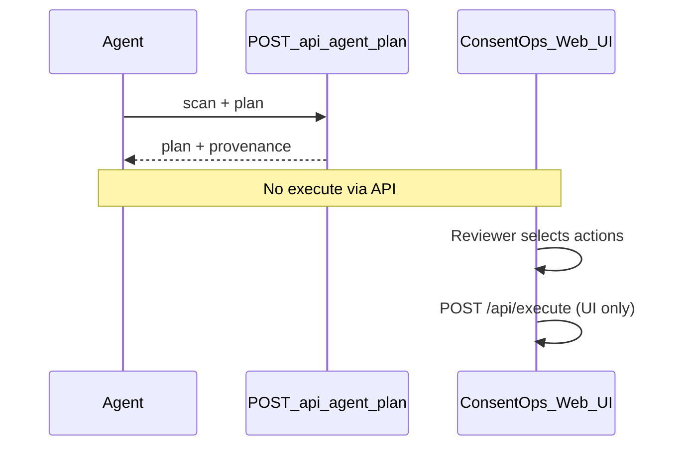

# ConsentOps Agent — OpenAPI and tool import

This folder documents the **read-only** agent API for hackathon judges, **Vertex AI Agent Builder**, and other integrators.

| File | Purpose |
|------|---------|
| [consentops-agent.yaml](./consentops-agent.yaml) | Full OpenAPI 3.1 spec — local + Cloud Run servers |
| [consentops-agent-cloudrun.yaml](./consentops-agent-cloudrun.yaml) | **Agent Builder import** — single hosted server, trimmed schemas |
| [../agent-builder-setup.md](../agent-builder-setup.md) | Step-by-step Agent Builder chat front-end setup |
| [../agent-builder-system-prompt.txt](../agent-builder-system-prompt.txt) | Copy-paste system instructions for the agent |
| This README | Tool import reference |

## What this API does (and does not do)

**Does:**

- Scan the synthetic demo warehouse for a consent subject
- Return Fivetran **read-only** connector status (redacted IDs)
- Generate a classified cleanup plan with planner provenance (`gemini` or `deterministic`)

**Does not:**

- Execute cleanup (`POST /api/execute` is **not** in the spec)
- Accept approval tokens or action ID lists for execution
- Trigger Fivetran syncs or BigQuery DML
- Certify GDPR or legal compliance

**Synthetic data only.** Do not send real personal data.

## Base URL

| Environment | URL |
|-------------|-----|
| Local | `http://localhost:3000` |
| Cloud Run | Your deployed service URL (see [cloud-run-deployment.md](../cloud-run-deployment.md)) |

Update the `servers` entry in `consentops-agent.yaml` before publishing.

## Quick test with curl

```bash
curl -s -X POST http://localhost:3000/api/agent/plan \
  -H "Content-Type: application/json" \
  -d '{}' | jq '.capability, .source, .scan.beforeCount, (.plan.actions | length)'
```

Expected (without `GEMINI_API_KEY`): `scan_and_plan_only`, `deterministic`, `37`, `37`.

## Import as an agent tool

### Option A — Vertex AI Agent Builder (recommended chat front-end)

Follow **[agent-builder-setup.md](../agent-builder-setup.md)**:

1. Create an **OpenAPI tool** from [consentops-agent-cloudrun.yaml](./consentops-agent-cloudrun.yaml).
2. Create an agent with [agent-builder-system-prompt.txt](../agent-builder-system-prompt.txt).
3. Chat runs scan + plan via `POST /api/agent/plan`; users open the **ConsentOps web UI** to approve, execute, and audit.

### Option B — OpenAPI / function-calling (generic)

1. Host ConsentOps (local or Cloud Run).
2. Point your agent runtime at `docs/openapi/consentops-agent.yaml`.
3. Register **one** tool from operation `consentOpsScanAndPlan` (`POST /api/agent/plan`).
4. In the agent system prompt, state:
   - Use this tool only to **discover** matches and **propose** a plan.
   - Never call execute endpoints; human approval happens in the ConsentOps web UI.
   - Demo uses fictional Ana Reyes data only.

**Example tool metadata (conceptual):**

```json
{
  "name": "consentOps_scan_and_plan",
  "description": "Scan synthetic warehouse for subject PII spread and return a classified cleanup plan. Read-only — does not execute deletions.",
  "parameters": {
    "type": "object",
    "properties": {
      "subject": {
        "type": "object",
        "description": "Optional synthetic subject overrides; omit for demo default"
      }
    }
  }
}
```

### Option C — Gemini / Vertex AI OpenAPI tool (manual)

1. Upload or reference `consentops-agent.yaml` in your tool configuration.
2. Restrict the model to the single `POST /api/agent/plan` path.
3. Do not expose `/api/execute` or other write routes.

### Option D — Custom HTTP tool

| Field | Value |
|-------|-------|
| Method | `POST` |
| Path | `/api/agent/plan` |
| Body | `{}` or `{ "subject": { ... } }` |
| Success | `200` with `capability: "scan_and_plan_only"` |

Reject any client wrapper that adds `approvalId`, `approvedActionIds`, or `execute` — the server returns `400`.

## Response fields agents should surface

| Field | Use |
|-------|-----|
| `source` | Tell the user whether Gemini or deterministic planner ran |
| `warning` | Show when fallback occurred |
| `scan.beforeCount` | Records matched before cleanup |
| `plan.actions` | Proposed record-scoped actions — **not executed** |
| `blockedActions` | Policies the demo blocks automatically |
| `disclaimer` | Repeat synthetic-only + UI approval requirement |

## Human-in-the-loop flow



## Validation

- Spec matches [src/app/api/agent/plan/route.ts](../../src/app/api/agent/plan/route.ts)
- Tests: [tests/agentPlanRoute.test.ts](../../tests/agentPlanRoute.test.ts)
- Platform checklist: [platform-proof-plan.md](../platform-proof-plan.md)

## Security notes

- No API keys in this spec; Gemini keys stay server-side (`GEMINI_API_KEY` via env or Secret Manager).
- Fivetran connector IDs in responses are redacted (`connector_01`, etc.).
- Do not commit secrets or raw production connector/account IDs to the repo.
